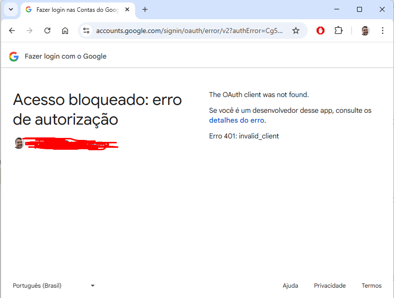
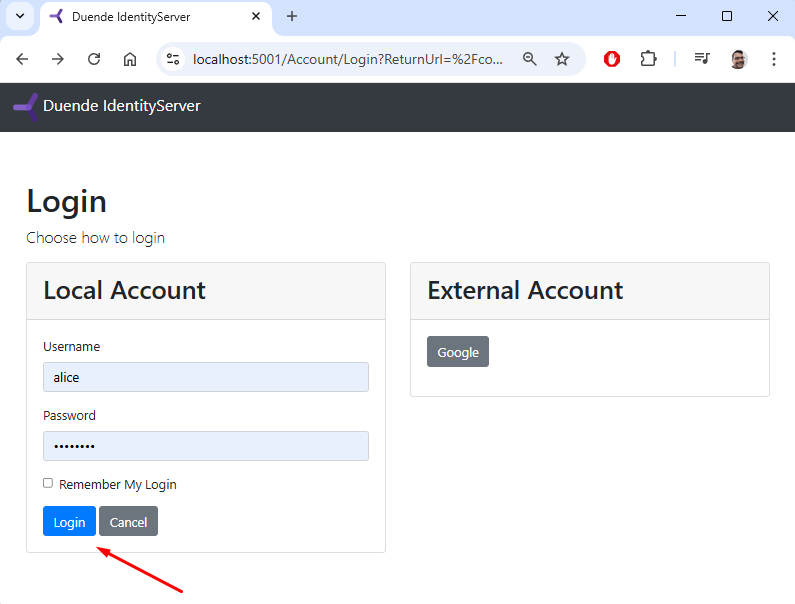
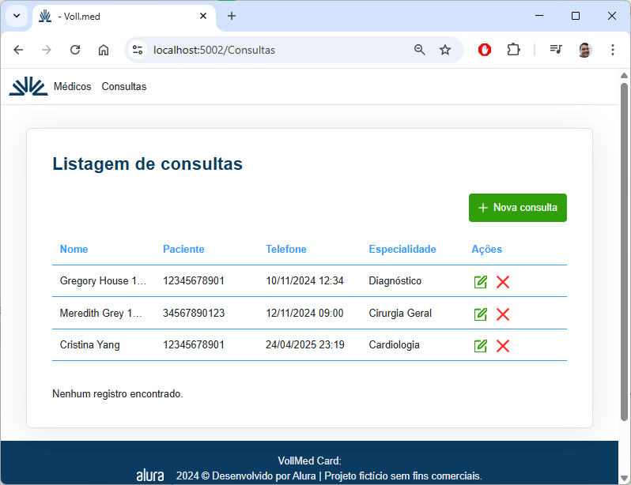

# ✅ Guia de Instalação e Teste do Projeto MedVoll

Este tutorial orienta você a configurar, executar e testar uma solução ASP.NET Core composta por três projetos:

- `MedVoll.Web` – Interface do usuário
- `MedVoll.WebAPI` – API REST de dados médicos
- `MedVoll.Identity` – Servidor de identidade para autenticação

---

## 1. Baixar a solução (na branch Aula0)

https://github.com/marcelooliveira/projeto-seguranca-aspnetcore-3/archive/refs/heads/Aula0.zip

```bash
cd projeto-seguranca-aspnetcore-3
```

---

## 2. Popular dados iniciais

### 🔸 Popular usuários no Identity:

```bash
cd MedVoll.Identity
dotnet run -- /seed
```

Esse comando adiciona usuários de teste (como Alice Smith) ao banco de dados do projeto `MedVoll.Identity`.

---

### 🔸 Popular dados da WebAPI:

```bash
cd ..\MedVoll.WebAPI
dotnet ef database update
```

Esse comando aplica as migrations e popula o banco com médicos e consultas de exemplo.

---

## 3. Configurar a Solução no Visual Studio

Abra a solução `MedVoll.sln` no Visual Studio.

### 🔧 Configure os projetos de inicialização:

1. Clique com o botão direito na **solução** > **Properties**.
2. Vá até a seção **Common Properties > Startup Project**.
3. Selecione **Multiple startup projects**.
4. Configure como abaixo:

| Projeto              | Ação     | Debug target |
|----------------------|----------|--------------|
| MedVoll.Web          | Start    | https        |
| MedVoll.WebAPI       | Start    | https        |
| MedVoll.Identity     | Start    | SelfHost     |

Clique em **OK** para salvar.

---

## 4. Executar a Solução

Pressione `F5` ou clique em **Iniciar depuração**. Isso abrirá os três serviços localmente:

- **Frontend (MedVoll.Web)**: https://localhost:5002  
- **WebAPI (MedVoll.WebAPI)**: https://localhost:6001  
- **Identidade (MedVoll.Identity)**: https://localhost:5001  

---

## 5. Testar a Aplicação

### 🔹 Etapas de Teste:

1. Acesse: **https://localhost:5002**  
   → Deve carregar a **home page** do projeto MedVoll.Web.


2. Clique no menu **Consultas**  
   → Você será redirecionado para a página de login em: **https://localhost:5001**.


3. Clique em **Google**  
   → Deve ocorrer um erro (esperado), pois a aplicação ainda não está configurada com autenticação do Google.

   

4. Volte para a página de login e entre com o usuário de teste:

```
Login: alice  
Senha: Pass123$
```



5. Após o login, você será redirecionado para:  
   **https://localhost:5002/Consultas**



6. Pressione `F12` no navegador (Chrome) para abrir as **Ferramentas do Desenvolvedor**.

7. Vá até a aba **Rede (Network)**, filtre por **Doc** e recarregue a página.

8. Confirme que os dados foram exibidos corretamente na interface da página **Consultas**.

---

## 📝 Observações Finais

- A autenticação entre os projetos é feita via **IdentityServer**.
- O projeto simula um fluxo de login, autorização e chamada autenticada à API.
- O erro com o login do Google é proposital, para mostrar o fallback ao login local.
- O usuário `alice` é um dos exemplos criados no seed inicial.
